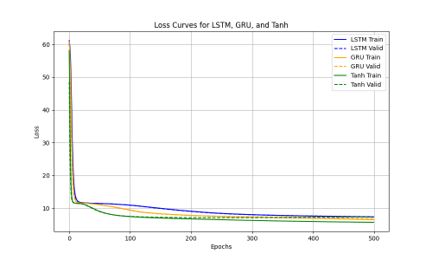
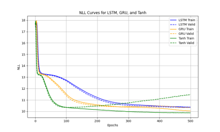
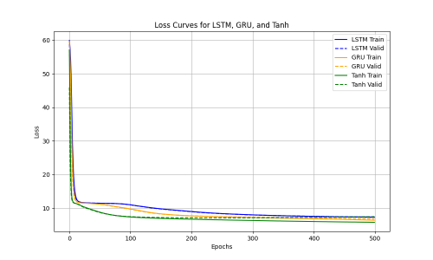
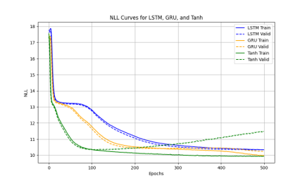

# LSTM, GRU and Tanh Model
This repository compared the LSTM, GRU, and traditional tanh models. These three models are trained using [JSB-Chorales](https://github.com/czhuang/JSB-Chorales-dataset) and [Nottingham datasets](https://abc.sourceforge.net/NMD/) datasets. The implementation of these models is based on this [paper](https://arxiv.org/pdf/1412.3555).

# Requirements
Install the required packages: [music21](https://pypi.org/project/music21/), [torch](https://pytorch.org/get-started/locally/), [matplotlib](https://matplotlib.org/stable/install/index.html)
```bash
pip install -r requirements.txt
```

# Datasets
Both the JSB-Chorales and Nottingham datasets represent musical data. However, the JSB-Chorales dataset consists of sequences of four-part music composed of 88 MIDI note numbers, while the Nottingham dataset is provided as an abc file that contains a one-part music sequence of 88 MIDI note numbers along with metadata. Therefore, the JSB-Chorales dataset can be used directly with the supplied pkl file, whereas the abc file of the Nottingham dataset must be processed into a pkl file. This repository offers not only the pkl file for the JSB-Chorales dataset but also the preprocessed pkl file for the Nottingham dataset. For details on how to conver the abc file to a pkl file, please refer to abc_to_pkl.py.

# Models
Three models are provided in two versions. In the torch_models.py script, the three models are implemented using layers from the torch library. These models are fast and deliver reliable performance. In contrast, the lstm_model.py, gru_model.py, and tanh_model.py scripts implement the three models using custom-built layers, allowing you to observe the detailed computational flow.  
These model are based on the following papers: the LSTM model is based on this [paper](https://ieeexplore.ieee.org/document/885150). Although the LSTM was first introduced in this [paper](https://www.bioinf.jku.at/publications/older/2604.pdf), it is now the commonly used version. The GRU model is based on this [paper](https://arxiv.org/abs/1406.1078).

# Training
You can train all three models using the train.py script. This code provides both versions of the three models via the torch_models or models variables, and you can select which set to train by changing the models variable in the for loop (i.e., using torch_models). Additionally, you can configure the training by modifying the following variables: configure the model parameter with input_dim, hidden_dims, layer_dim, and output_dim. By default, hidden dims is set to 36 for LSTM, 46 for GRU, and 100 for tanh to keep the number of traning parameters approximately the same; configure data loader settings using batch_size and max_length; set up trainer using num_epochs and learning_rate.

# Result
These are the results of training for 500 epoches on the JSB-Chorales dataset using the default settings.
| Version of models | Loss Curves | NLL Curves |
|:-------:|:-------:|:-------:|
| torch version |  |  |
| custom-built version |  |  |  

Followings are the final NLL values. First, the values reported in the papaer are as follows:
| Sets | tanh | GRU | LSTM |
|:-------:|:-------:|:-------:|:-------:|
| Train | 8.82 | 6.94 | 8.15 |
| Test | 9.19 | 8.54 | 8.67 |  

Second, the values from torch version implementations. Any values represented by '.' were not recoreded due to certain constraints.
| Sets | tanh | GRU | LSTM |
|:-------:|:-------:|:-------:|:-------:|
| Train | . | 10.02 | 10.37 |
| Test | 11.72 | 10.56 | 10.63 |  

Last the values from custom-built version implementations.
| Sets | tanh | GRU | LSTM |
|:-------:|:-------:|:-------:|:-------:|
| Train | 9.93 | 9.99 | 10.33 |
| Test | 11.74 | 10.52 | 10.62 |
